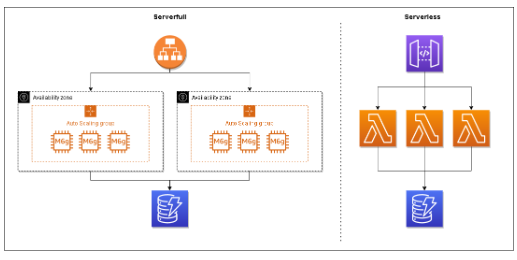

There are certain workloads that are significantly more expensive to run serverless, but the tipping point is usually difficult to objectify. Best thing we can do is analyze our spend on a heuristic-based approach.

The two applications we will compare is a load balanced EC2 fleet optimized for compute against a serverless app backed exclusively by Lambda functions.

We will ignore egress data charges and CloudWatch charges since both of those will be present in both apps. 

`Lambda` is priced per GB/s and invocation. For our calculations, we will assume our functions are configured to use 1024MB memory.

50 requests per second (RPS) sum up to a total of 129.6M requests per month, which we will use below.

$.0000000133 x 200ms x 129.6M invocations + (129.6M/1M x $.2) =  $370.65

"Using this little calculator we can see that once you reach an average of 66 requests per second, serverless becomes more expensive."

`AWS App Runner` is a relatively new service that went generally available in May of 2021. It is a managed service that builds, deploys, load balances, and scales containerized web apps and APIs automatically.

Pricing is a little simpler and less variable with App Runner than EC2. You pay for compute and memory resources consumed by your application, similar to Lambda. You pay $.064 per vCPU-hour and $.007 per GB-hour.

To match the example app we were pricing above, we will configure our containers to run 2 vCPUs and 4GB of memory.

Each container in App Runner can handle up to 80 concurrent requests per second. Our example app operates at 50 requests a second, so we can estimate costs just on a single App Runner container.

($0.064 x 2 vCPUs) + ($0.007 x 4 GB memory) x 24 hours x 30 days x 1 container instance = $112.32

From our example above, we already know that `Lambda is more expensive to operate at $370.65`. So in this case, App Runner is less expensive to operate. Using our calculator from before, we can determine that `applications running 15 requests per second or fewer will be cheaper to run on serverless` with this configuration.

## Summary - what about TCO
The most important thing to remember is TCO. There is much more to cost than just the number at the bottom of your monthly bill. Ongoing maintenance, slower development times, complex networking, etc… all play a part in how much an application actually costs to run.

Serverless costs are linear with usage, it does not get more expensive the more you use it. Oftentimes, it actually gets cheaper! Running into a situation where serverless becomes too expensive feels like a good problem to have. That means your app is gaining popularity and a new set of challenges comes into play.

Source: https://www.readysetcloud.io/blog/allen.helton/when-is-serverless-more-expensive/?ref=highscalability.com